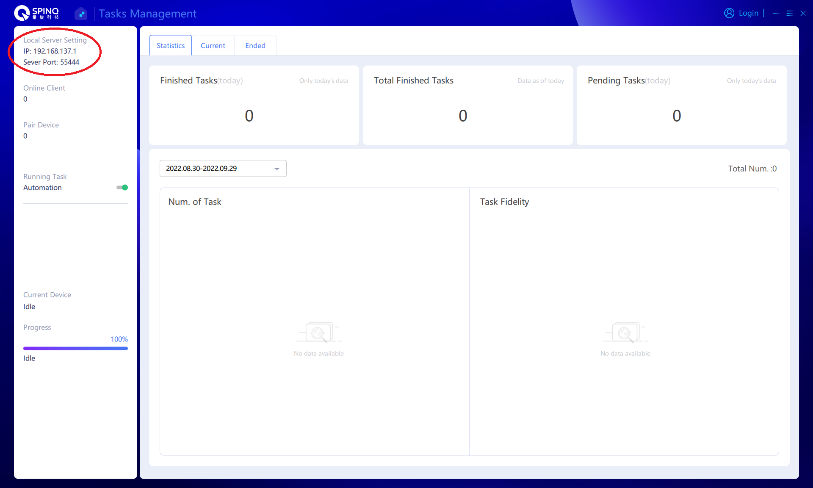

# Basics
## Requirements

- SpinQKit is available on Windows, Linux and MacOS. Only the **Windows** version can use the  Triangulum machine as a backend. This package has been tested on Ubuntu 20.04, Windows 10, Mac Mojave 10.14.8 and Mac Monterey 13.4.
- SpinQKit requires Python 3.8+.  This package has been tested with Python 3.8.13 and 3.9.12.
- We suggest you use Anaconda to set up your Python environment. Please refer to [https://docs.anaconda.com/anaconda/](https://docs.anaconda.com/anaconda/) about how to install and use a conda environment. On Windows, we suggest adding Anaconda to your PATH environment viarable to avoid unnecessary troubles.
## Installation
SpinQKit can be installed using the following command:
```python
pip install spinqkit
```

To build from the source on Github, you need a C/C++ compiler and CMake in addition. We do not suggest this way unless you are very familiar with the tools.
## First Example
The following example is a simple quantum program using SpinQKit Python syntax. You can run it as a Python script.
```python
from spinqkit import get_basic_simulator, get_compiler, Circuit, BasicSimulatorConfig
from spinqkit import H, CX, Rx
from math import pi

# Write the program
circ = Circuit()
q = circ.allocateQubits(2)
circ << (Rx, q[0], pi)
circ << (H, q[1])
circ << (CX, (q[0], q[1]))

# Choose the compiler and backend
comp = get_compiler("native")
engine = get_basic_simulator()

# Compile
optimization_level = 0
exe = comp.compile(circ, optimization_level)

# Run
config = BasicSimulatorConfig()
config.configure_shots(1024)
result = engine.execute(exe, config)

print(result.counts)
```

Output:
```
{'10': 512, '11': 512}
```

There are three steps in a SpinQKit program. 

1. Write the program. The example above shows how to allocate qubits and apply quantum gates to the qubits.
2. Compile the program to an intermediate representation using the proper compiler. 
3. Run the code using your favored backend. The example above uses the SpinQ simulator.

More details about the syntaxes, compilers and backends will be introduced in the next section.

# Programming

## Syntax
SpinQKit supports three types of programming syntaxes:  native SpinQKit Python syntax which is introduced above, [OpenQASM 2.0](https://arxiv.org/abs/1707.03429) syntax, and [IBM Qiskit](https://qiskit.org/) Python syntax. 

### SpinQKit Python

**Circuit**: In SpinQKit, each quantum program is a Circuit instance.

**Quantum register**: A quantum register has a certain number of qubits, and must be allocated by a circuit using allocateQubits. A qubit is represented by the register name and the index. 

**Classical register**: A classical register has a certain number of classical bits, and must be allocated by a circuit using allocateClbits. A classical bit is represented by the register name and the index. A classical bit stores a measurement result in the quantum program, which is used by following if conditions.

**Quantum gates**: SpinQKit defines 20 logic quantum gates (I, H, X, Y, Z, Rx, Ry, Rz, P, T, Td, S, Sd, CX/CNOT, CY, CZ, U, CP, SWAP, CCX) and two special gates (MEASURE and BARRIER).

**Instruction**: An instruction consists of a quantum gate, qubits, optional classical bits, and optional rotation radian for rotation gates. SpinQKit uses << to add an instruction to a circuit, as shown in the example above.

**Custom quantum gate**: SpinQKit provides a gate builder to define a custom quantum gate. The builder builds a gate based on sub-gates. There are qubit indexes and optional parameter lambda defined for each sub-gate. For example, a custom gate to generate a Bell state can be defined as follows:

```
Bell_builder = GateBuilder(2)
Bell_builder.append(H, [0])
Bell_builder.append(CX, [0, 1])
Bell = Bell_builder.to_gate()
circ << (Bell, (q[0], q[1]))
```

**Condition based on measurements**: In SpinQKit, a Circuit has a measure method to measure some of the qubits and store the result into classical bits. This method inserts a special MEASURE gate into the circuit. After the measurement, a gate can be conditionally applied, and the condition is based on the value of classical bits. Such a flow control is also known as cif. A condition in SpinQKit is a tuple of a list of classical bits, a comparator string ('==', '!=', '>', '>=', '<', '<='), and an integer. The | operator is used to add a condition to an instruction. The usage will be like 
```
circ = Circuit()
q = circ.allocateQubits(2)
c = circ.allocateClbits(2)
circ << (H, q[0])
circ << (X, q[1])
circ.measure(q[0], c[0])
circ << (H, q[1]) | (c, '==', 0)
```

The MEASURE gate cannot be used in a custom gate or used with cif. Currently, this feature is only supported by the SpinQ simulator.


### OpenQASM 2.0
SpinQKit supports OpenQASM 2.0. The basic gates allowed in SpinQKit include id, x, y, z, h, rx, ry, rz, t, tdg, s, sdg, p, cx, cy, cz, swap, ccx, u, U, CX, measure, and barrier. Other standard gates in OpenQASM can be called by including "qelib1.inc" which is provided by SpinQKit and exactly the same with the library file in OpenQASM.

```
OPENQASM 2.0;
include "qelib1.inc";

gate bell a,b
{
h a;
cx a,b;
}

qreg q[2];
creg c[2];

h q[0];
cx q[0],q[1];
bell q[0],q[1];
```
### IBM Qiskit
SpinQKit also supports IBM Qiskit Python interface. We include the qiskit.circuit package and some related packages in SpinQKit. Therefore, you can construct a Qiskit QuantumCircuit instance and run it with SpinQKit, even without installing Qiskit. Particularly, SpinQKit has supported QFT, QPE, and Grover primitives in Qiskit (in qiskit.circuit.library) so that you can build up your quantum algorithms based on these primitives. Nevertheless, SpinQKit does not include all the Qiskit code. If you want to use the qiskit.algorithm package and run the circuit on SpinQKit backends, you still need to install Qiskit.

```python
from qiskit.circuit import QuantumCircuit
qc = QuantumCircuit(2)
qc.x(0)
qc.rx(pi, 0)
qc.cx(0, 1)
```
## Compiler
Each syntax has its corresponding compiler. The get_compiler method is used to choose the compiler. The three options are “native”, “qasm”, and “qiskit”. All the compilers have a compile method with two arguments, and the second argument is always the optimization level, but the first argument is different. 

The native compiler takes a Circuit instance in SpinQKit as the first argument. 
```python
circ = Circuit()
...
comp = get_compiler("native")
exe = comp.compile(circ, optimization_level)
```
The qasm compiler takes the path to a qasm file as the first argument. 
```python
comp = get_compiler('qasm')
exe = comp.compile("test/spinq/callee.qasm", optimization_level)
```
The qiskit compiler takes a Qiskit QuantumCircuit instance as the first argument.
```python
circ = QuantumCircuit(3)
...
comp = get_compiler("qiskit")
exe1 = comp.compile(circ, optimization_level)
```

### Compilation Optimization

SpinQKit provides basic circuit optimization features. There are four optimization levels in SpinQKit compilers, corresponding to different combinations of optimization algorithms. 

**Level 0** means no optimization algorithm is applied. 

**Level 1** contains two passes and two algorithms are applied in order. The first one is canceling consecutive redundant gates. If a series of same gates operate on the same qubit(s) and these gates can be removed without affecting the final result, e.g., H and CX, this algorithm will remove these gates from the circuit. If a number of rotation gates rotates the same qubit around the same axis, the algorithm will combine them into one rotation gate. The second algorithm collapses more than 3 consecutive single-qubit gates on the same qubit into several basic gates. The algorithm calculates the matrix that represents these gates and decomposes the matrix to basic gates. Currently, SpinQKit uses ZYZ decomposition. 

**Level 2** contains the two algorithms in Level 1 and then applies a third algorithm. The third algorithm collapses more than 6 consecutive two-qubit gates on the same two qubits into certain Ry, Rz, and CX gates.  The algorithm also calculates the matrix that represents the original gates and then decompose the matrix.

**Level 3** first cancels redundant gates and then applies two optimization algorithms based on quantum state analysis introduced in [https://arxiv.org/abs/2012.07711v1](https://arxiv.org/abs/2012.07711v1). The two algorithms are reported to perform better than the most aggressive optimization level in Qiskit. After the two algorithm, the collapsing single-qubit gates and collapsing two-qubit gates passes are applied.

The optimization features in SpinQKit are still experimental. More algorithms are will be added in the future. Please let us know if you find any issue.

## Backend
SpinQKit has three different backends: the SpinQ classical simulator, the SpinQ cloud, and the Triangulum quantum computer from SpinQ. 
### Simulator
The code example shows how to use the SpinQ classical simulator to run a quantum program.
```python
engine = get_basic_simulator()
config = BasicSimulatorConfig()
config.configure_shots(1024)
result = engine.execute(exe, config)
```

In BasicSimulatorConfig, the total number of shots is configured for the SpinQ simulator so that the count of each possible binary reading is calculated in the result. 
### Triangulum
To use the Triangulum computer, you first need to get the network information and register an account on the machine.



The code example shows how to use the Triangulum computer backend in SpinQKit.
```python
engine = get_triangulum()
config = TriangulumConfig()
config.configure_ip("192.168.137.1")
config.configure_port(55444)
config.configure_account("user9", "123456")
config.configure_task("task2", "Bell")
result = engine.execute(exe, config)
```
In TriangulumConfig, the IP address and port number of Triangulum must be configured. You can also configure the task name and description.
### Cloud
In order to use the SpinQ cloud, you have to first register and add a public SSH key on [https://cloud.spinq.cn.](https://cloud.spinq.cn.) Please refer to the documentation online about the SpinQ cloud [https://cloud.spinq.cn/#/docs.](https://cloud.spinq.cn/#/docs.) Username and key information are required to use the cloud backend. 

SpinQ provides multiple platforms with different number of qubits on the SpinQ cloud. The cloud backend has a get_platform method, and this method can provide four platforms “gemini_vp”, “nmr_vp_4”, “nmr_vp_6”, “superconductor_vp”. These platforms have 2, 4, 6, and 8 qubits respectively and support only quantum programs with fewer qubits. 

The following example shows how to use the cloud backend and login using your SSH key.

```python
username = "username"
message = username.encode(encoding="utf-8")

with open("\path\to\keyfile") as f:
    key = f.read()

rsakey = RSA.importKey(key)
signer = Signature_pkcs1_v1_5.new(rsakey)
digest = SHA256.new()
digest.update(message)
printable = digest.hexdigest()
sign = signer.sign(digest)
signature = base64.b64encode(sign)
signStr = str(signature, encoding = "utf-8")

# login
backend = get_spinq_cloud(username, signStr)

# choose a platform
gemini = backend.get_platform("nmr_vp_4")
print("nmr_vp_4 has " + str(gemini.machine_count) + " active machines.")

if gemini.available():
    comp = get_compiler("native")
    circ = Circuit()
    ...
    ir = comp.compile(circ, 0)
    newTask = backend.submit_task("nmr_vp_4", ir, "spinqkittask2")
    res = newTask.get_result()
else:
    print("No machine available for this platform.")
```
## Result
SpinQKit provides four types of results. First, all the backends can provide the probabilities of binary readings as follows:
```
print(result.probabilities)
{'10': 0.4999999999809753, '11': 0.4999999999809753}
```
Please notice that SpinQKit uses the little endian, i.e., the first bit in the result binary string corresponds to the first qubit in the quantum circuit. 

Second,  the count of each possible binary reading can be found in the result only when the simulator backend is used. The total number of shots is configured otherwise 1024 will be used by default. 
```
print(result.counts)
{'10': 512, '11': 512}
```
Third, with the simulator, a random binary reading can be obtained from the result according to the probabilities via a get_random_reading method. 
```
print(result.get_random_reading())
11
```
Fourth, the simulator backend can provide the state vector of all the qubits when there is no measure gate or conditional gate based on the value of a classical register.
```
print(result.states)
[(1.37812710729329e-10+0j), (1.37812710729329e-10+0j), -0.7071067811865476j, -0.7071067811865476j]
```

## Library

SpinQKit provides useful APIs for developers to use in their own quantum programs. 

### GateBuilders

A gate builder is used to define a custom gate. The developer needs to call the to_gate method of a builder to get the gate. SpinQKit also provides several specific gate builders:

<dl class="function"><dt>RepeatBuilder</dt></dl>


| Arguments: | **g** - Gate, the gate to repeat <br> **repeat** - int, how many qubits to apply g <br> **param_lambda** - float or Callable,  optional parameters of gate, and its default value is None |
|:-----|:-----|
| Description: | <span style="white-space:normal;">This class defines a gate which applies the same subgate like Hadamard on multiple qubits. <br> Example: RepeatBuilder(H, 4)</span> |

<br/>

<dl class="function"><dt>InverseBuilder</dt></dl>


| Arguments: |**gate** - Gate，the gate to inverse|
|:-----|:-----|
| Description: |<span style="white-space:normal;">This class creates the inverse gate of a given gate.<br> Example: InverseBuilder(X)</span>|

<br/>

<dl class="function"><dt>MultiControlPhaseGateBuilder</dt></dl>

| Arguments: |**ctrl_qubit_num** - int, the number of control qubits. Please notice that the total number of qubits for the generated gate is the number of control qubits plus one.|
|:-----|:-----|
| Description: |<span style="white-space:normal;">This class creates a multi-control phase gate or a multi-control Rz gate.<br> Example: MultiControlPhaseGateBuilder(3)</span>|

<br/>

### Primitives

The primitives in this section are subroutines used frequently in quantum programming. These primitives generate instructions or a composite gate to finish the quantum operations. Before generating the instructions, a Circuit instance must be created and qubits must be allocated.

<dl class="function"><dt>generate_power_gate</dt></dl>

| Arguments: |**gate** - Gate, the base gate <br> **exponent** - int or float, the exponent <br> **qubits** - List,  where to apply the power of gate <br> **params** - List, optional parameters of gate, and the default value is [] <br> **control** - bool,  whether to generate the controlled power gate, and the default value is False <br> **control_bit** - int, the control qubit, by default it is None|
|:-----|:-----|
| Description: |<span style="white-space:normal;">This method generates the instructions that represent the power of a given gate. The power of the argument “gate” is decomposed to a group of subgates in this function. When “control” is True, the instructions represent the controlled power gate and the argument “control_bit” must be set.</span>|

<br/>

<dl class="function"><dt>generate_vector_encoding</dt></dl>

| Arguments: |**vector** - np.ndarray, the input vector <br> **qubits** - List, the qubits to encode the input vector|
|:-----|:-----|
| Description: |<span style="white-space:normal;">This method generates the instructions that prepare the quantum state to encode the given vector. The normalized state vector is equal to the normalized input vector.</span>|

<br/>

<dl class="function"><dt>AmplitudeAmplification</dt></dl>

| Arguments: |**flip** - Gate, the gate to flip the phase of the target <br> **flip_qubits** - List,  the qubits to apply the flip gate <br> **flip_params** - List, the optional parameters in the flip gate <br> **state_operator** - Gate, the gate to prepare the state that represents the search space, by default using uniform superposition <br> **state_qubits** - List, the qubits to prepare the state <br> **state_params** - List, the optional parameters in the state operator gate <br> **reflection_qubits** - List, the qubits to apply the reflect operation|
|:-----|:-----|
| Description: |<span style="white-space:normal;">This class generates the instructions for amplitude amplification. The build method of this class returns the instruction list. We provide a Grover example that uses amplitude amplification in example/grover_example.py.</span>|

<br/>

<dl class="function"><dt>QFT</dt></dl>

| Arguments: |**qubit_num** - int, the number of qubits to apply QFT|
|:-----|:-----|
| Description: |<span style="white-space:normal;">QFT is short for Quantum Fourier Transform. This class generates a gate to do quantum Fourier transform. The build method return the QFT gate, while the inverse method return the inverse QFT gate.</span>|

<br/>

<dl class="function"><dt>PhaseEstimation</dt></dl>

| Arguments: |**unitary**: Gate, the gate to apply quantum phase estimation <br> **state_qubits**: List, the qubits that encode the eigenvector <br> **output_qubits**: List, the qubits that output the estimation result <br> **params**: List, optional parameters of the input gate, and [] by default|
|:-----|:-----|
| Description: |<span style="white-space:normal;">Phase Estimation is a class that generates instructions that estimate the eigenvalue of a given gate corresponding to a specific eigenvector. The build method return the QPE instructions, while the inverse method return the inverse QPE instructions. </span>|

<br/>

### Algorithms

SpinQKit provides APIs for multiple quantum algorithms so that users can run them directly. We provide example codes to show how to use these APIs.

<dl class="function"><dt>HHL</dt></dl>

| <span style="white-space:nowrap;"> Init Arguments:</span> |**mat_A**: np.ndarray, the coefficient matrix <br> **vec_b**: np.ndarray, the right side constant vector|
|:-----|:-----|
| Description: |<span style="white-space:normal;">Harrow-Hassidim-Lloyd (HHL) quantum algorithm is used to solve a system of linear equations. An HHL instance is constructed by HHL(mat_A, vec_b). The ***run*** method of HHL is used to run the solver. After that, the ***get_measurements*** method is used to get the probabilities of different measurements from the solver. Only with the simulator backend, the ***get_state*** method can be used to get the state vector of the result from the solver. An example of the HHL solver is in example/hhl_example.py.</span>|

<br/>

<dl class="function"><dt>VQE</dt></dl>

| <span style="white-space:nowrap;">Init Arguments:</span> |**qubit_num**: int, the qubit number in the ansatz <br> **depth**:int, the depth of rotation gates in the ansatz <br> **hamiltonian**: np.ndarray or List, the input Hamiltonian <br> **optimizer**: Optimizer, the optimizer used to optimize the variational parameters <br> **ansatz**: Gate, None by default, the gate that implements the variational principle <br> **ansatz_params**: List, None by default, the parameters in the ansatz|
|:-----|:-----|
| Description: |<span style="white-space:normal;">VQE is short for variational quantum eigensolver, which finds the minimum eigenvalue of a Hermitian matrix ***H***. VQE uses a parameterized ansatz to implement the variational principle. When ***H*** describes the Hamiltonian of a system, VQE can obtain the ground state energy of the Hamiltonian. The input Hamiltonian can be a matrix. It can also be described by its Pauli decomposition, i.e., a list of (Pauli string, coefficient) pairs. SpinQKit provides an ADAM optimizer to optimize the VQE ansatz parameters. An example of VQE can be found in example/vqe_example.py</span>|

<br/>

<dl class="function"><dt>QAOA</dt></dl>

| <span style="white-space:nowrap;">Init Arguments:</span> |**qubit_num**: int, the qubit number <br> **step**: int, the repetition times <br> **problem**: Gate, the problem unitary <br> **problem_param_num**: int, the number of parameters in the problem gate <br> **init_state_gate**: Gate, None by default, the gate to initialize the state <br> **mixer**: Gate, None by default, the parameterized mixer gate <br> **mixer_param_num**: int, 1 by default, the number of parameters in the mixer gate|
|:-----|:-----|
| Description: |<span style="white-space:normal;">Quantum Approximate Optimization Algorithm (QAOA) is a variational algorithm to solve combinatorial optimization problems. A specific problem is encoded using a Hamiltonian. QAOA uses one parameterized mixer gate and one problem gate based on the problem Hamiltonian. The two gates are repeated multiple times as alternating blocks. The step argument means how many times to repeat. The ***run*** method of this class is used to execute the circuit. The example in example/qaoa_example.py shows how a max cut problem is solved using QAOA.</span>|

<br/>

<dl class="function"><dt>Quantum Counting</dt></dl>

| Init Arguments: |**counting_num**: int, the number of qubits to read out the count <br> **searching_num**: int, the number of qubits to apply the oracle <br> **prep**: Gate, the gate to prepare the states <br> **oracle**: Gate, the oracle to count <br> **prep_params**: List, [] by default, the optional parameters in the prep gate <br>**oracle_params**: List, [] by default, the optional parameters in the oracle gate|
|:-----|:-----|
| Description: |<span style="white-space:normal;">The Grover algorithm is designed to find a solution to an oracle function, while the quantum counting algorithm finds out how many of these solutions there are. This algorithm is a quantum phase estimation of the Grover operator. A quantum counting example can be found in example/quantum_counting_example.py.</span>|

<br/>

<dl class="function"><dt>Quantum Machine Learning</dt></dl>

| Description: |<span style="white-space:normal;">There is no specific class for quantum machine learning in SpinQKit, but we provide an example to show how to implement a quantum classifier using SpinQKit and PyTorch in example/qnn_example.py.</span>|
|:-----|:-----|

<br/>

<style>
html.writer-html5 .rst-content table {
  width:100%
}
html.writer-html5 .rst-content table th{
  vertical-align:middle;
  font-weight:normal;
}
html.writer-html5 .rst-content table th:nth-child(1) {
  width:150px;
}
html.writer-html5 .rst-content table th:nth-child(2) p{
  white-space:normal;
}
html.writer-html5 .rst-content table td:nth-child(2) p{
  white-space:normal;
}
</style>